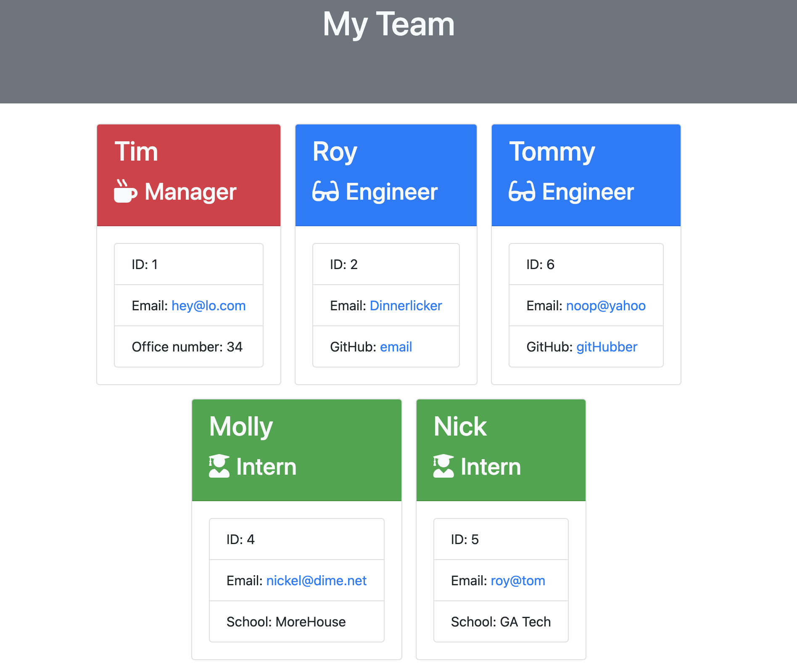

 # Team Generator

  ## Description
  This CLI application creates an HTML page showing your work team and related info.

  ***

  **Table of Contents:**
  - [Description](#description)
  - [Installation](#installation)
  - [Usage](#usage)
  - [Contribution](#contribution)
  - [Test](#test)
  - [License](#license)
  - [Questions](#questions)

  ***

  ## Installation
  Team Generator requires the use of Node.js. After installing Node.js, you must install the node module: Inquirer.

  ***

  ## Usage

  Team Generator uses prompts from Inquirer to easily collect information about your different team mates or peers. 
  
  After running `index.js` and selecting that you do not have anymore employees to add, a HTML file will be created in the dist/ folder that will display a cleaner presention based off the information you entered.

  The generated HTML file will be called `employees.html`.

  Click here for a video demo presentation.

  [GitHub repository](https://github.com/christopherginn/ch-10-team-profile-generator)

  Here is a screen capture of a demo:
  
  
  

  ***

  ## Contribution
  Not looking for contributions at this time, but feel free to reach out to me using my contact info in the [Questions](#questions) section.

  ***

  ## Test
  Team Generator can be tested with the node module Jest. Simply run `npm install jest`, then run `npm test`.

  The tests made for Team Generator check that classes for the Employees are assigning the correct key:values.

  ***

  ## License
  This project is under the GNU General Public License v3.0 and can be viewed [here](https://www.gnu.org/licenses/gpl-3.0.en.html).

  ***

  ## Questions
  Feel free to reach out to me either on Github or by email. 
  [My Github](https://github.com/christopherginn) 
  Email: hey.im.chris@live.com
